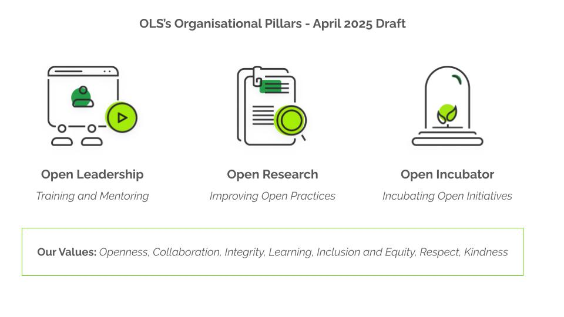

# OLS is seeking feedback on our proposed organisational values

***This document is open for community review.***
*The community Review Period is April - May 2025. The **last day for comment is 30th May 2025***.

## Background

This draft of values has been developed using feedback and input from the OLS Team, and Governance Advisory Committee in 2023 and 2024.

We have opened the draft for review and are currently accepting comments from our community via a Google Document - [shared in comment mode](https://docs.google.com/document/d/1SeAqomXt_ZrTYUQydOmqLgnI8tGxtCpr22Wu9xm5Y9g/edit?tab=t.0).

Details for the review process have been provided on the [issue #12](https://github.com/open-life-science/ols-governance/issues/12) and a blog post will be [shared on our website](https://we-are-ols.org/posts.html).

## Organisation Framework to Guide Our Areas of Work

*[Draft version]: Representation of OLS's Organisational Pillars: 1) Open Leadership, 2) Open Research, and 3) Open Incubator.*

## Draft of OLS's Proposed Values Start Here

### Proposed Values

- Openness
- Collaboration
- Integrity
- Learning
- Inclusion and Equity
- Respect and Kindness

Below we describe each of these values in two important contexts where our values will be operationalised:

* **Community-wide**:
   * OLS's values are operationalised in this context through projects and initiatives designed to engage community members both with OLS and with each other. Examples of these include the Open Seeds and Nebula training and mentoring programmes, Open Research projects, and the OLS incubator (fiscal hosting) initiative. Moreover, our values should guide the development and dissemination of OLS resources, the planning of events, and the formation of partnerships.

* **Work Process Example**:
   * OLS's values are operationalised in this context through internal organisational processes, team development, decision-making, ensuring that our principles guide how we operate and collaborate internally.

**Other considerations:**
   * **Global Perspective:**
       * Given OLS's international reach, values should be reviewed by community members to ensure they can be interpreted as intended by different community members in a culturally sensitive manner.
   * **Operationalisation:**
       * After community review, OLS will develop strategies for implementing each value. 
   * **Continual evaluation:** Values and their operationalisation are subjective and change with time. With recommendations and involvement from our Governance Committee, OLS will therefore create a space for continual evaluation of its values, and how they are being put into practice.

#### Value Description

* **Openness:**
    * **Community-wide:** OLS champions transparency through accessible resources, clear processes, and a commitment to 'as open as possible, as closed as necessary.' We strive to democratise knowledge and empower participation by making our work visible and understandable.
    * **Work process:** We foster a culture of reflection by regularly asking, 'How can we increase the openness of our work while maintaining the confidentiality of sensitive information without compromising the confidentiality of sensitive information?' This proactive approach drives continuous improvement and reinforces our commitment to open principles.
* **Collaboration:**
    * **Community-wide:** OLS cultivates a collaborative ecosystem where knowledge is co-created and shared freely, projects are designed for collaboration and diverse perspectives are valued. We believe that community collaboration drives innovation.
    * **Work process:** We build safe spaces and mutual trust within our teams, enabling open communication, constructive feedback, and shared ownership of our work.
* **Integrity:**
    * **Community-wide:** OLS is committed to responsible research practices, scientific integrity, transparent communication, and accountability.
    * **Work process:** We ensure rigour in our research, training, and services through research-based, transparent methodologies, and a commitment to ethical decision-making.
* **Learning:**
    * **Community-wide:** OLS is a dynamic learning community, where continuous growth and knowledge exchange are celebrated. We provide opportunities for skill development, peer learning, and mentorship for individuals to progress their work and communities in open science.
    * **Work process:** We invest in the continuous professional development of our team, providing opportunities for skill enhancement and fostering a culture of lifelong learning.
* **Inclusion & Equity:**
    * **Community-wide:** OLS is dedicated to creating an inclusive and equitable community, where diverse voices are amplified, and people feel welcome and valued, regardless of background, identity, or expertise.
    * **Work process:** We implement inclusive practices in all our team activities, ensuring equitable access to resources, opportunities, and support.
* **Respect & Kindness:**
    * **Community-wide:** OLS fosters a supportive and compassionate community, where we build strong relationships through respect and kindness towards all members.
    * **Work process:** We cultivate a culture of kindness and respect within our team, ensuring that all members feel valued and supported.
